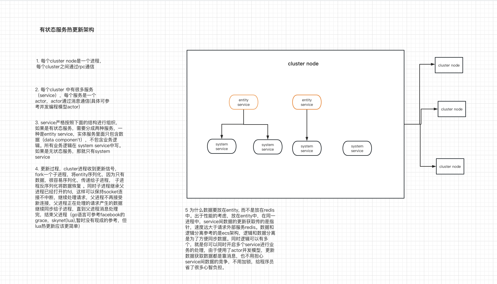

## goskynet
go 实现的skynet cluster，可以和lua版的skynet互相通信。集群底层网络linux使用的是netpoll，macosx和windows使用的是go标准的网络，详情可以看[network/skynet/cluster.go](network/skynet/cluster.go) listen方法。未来想实现[优雅的热重启](#优雅的热重启)。
## 鸣谢
* 云风大佬的[skynet](https://github.com/cloudwu/skynet.git)
* 字节跳动的[netpool](https://github.com/cloudwego/hertz/tree/develop/pkg/network/netpoll)
# env
* os: linux macosx windows(暂时没有时间测试)
* go: 1.20.1
* make: GNU Make 3.81

## example
```bash
# service的例子 example/service
# cluster的例子 example/cluster

# build and run test
# linux
make linux
# macosx
make macosx
```

## TODO
1. 封装cluster service, service/cluster.go
2. 优化netpack，buff使用对象池，减少gc
3. 集群配置文件
4. 优雅的热重启
5. 性能测试
## 优雅的热重启
